# LTSPICE Circuits
Collection of my various analog circuit simulations.

class-ab-rf

Class AB RF power amplifier

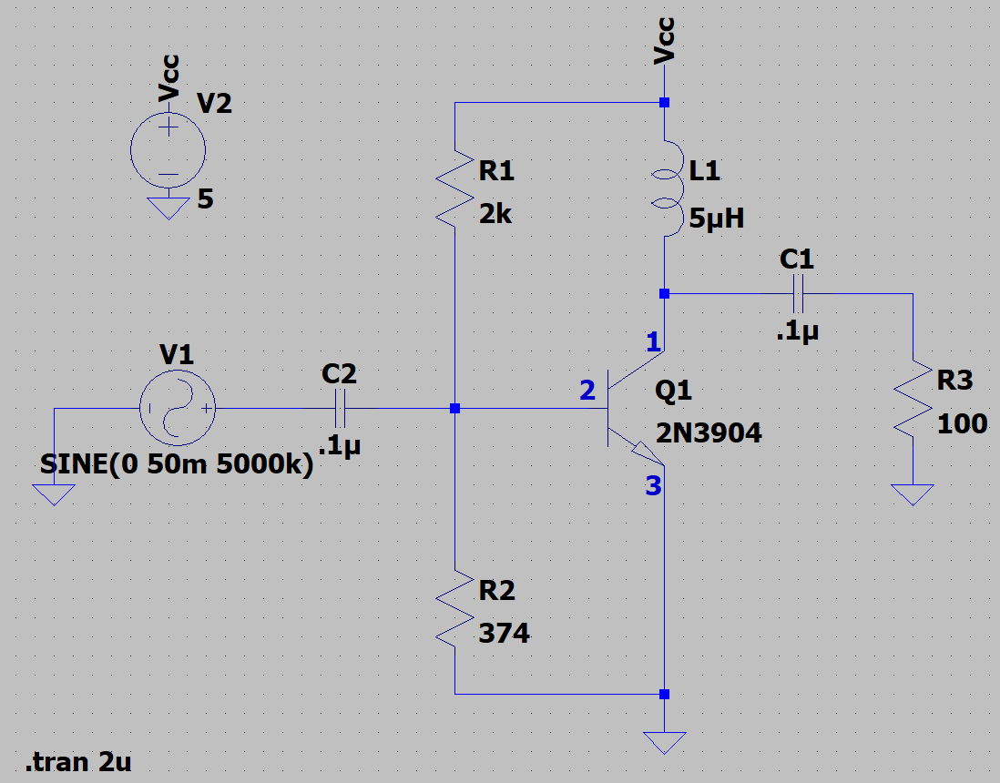

class-ab

Class AB amplifier with crossover reduction

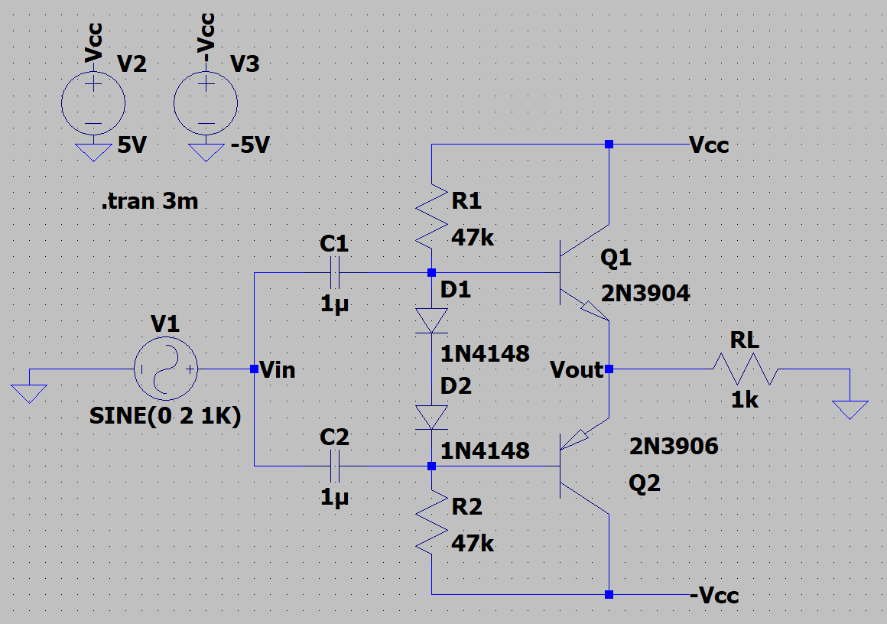

class-b-transformerless.asc

Class B amplifier using matched transistors conducting during each half-cycle

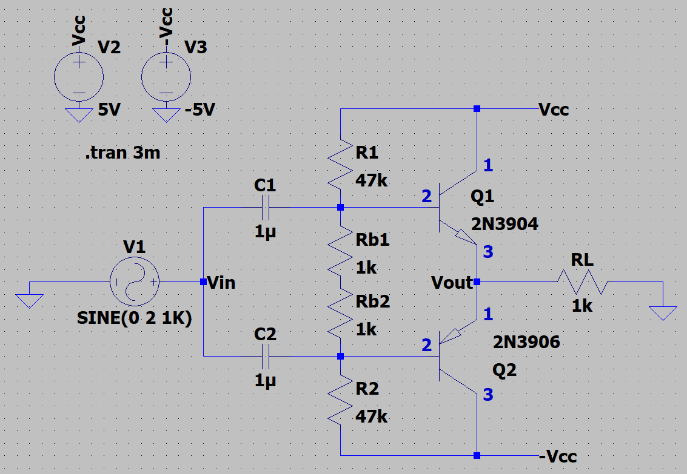

emitter-follower

Simple emitter follower buffer stage

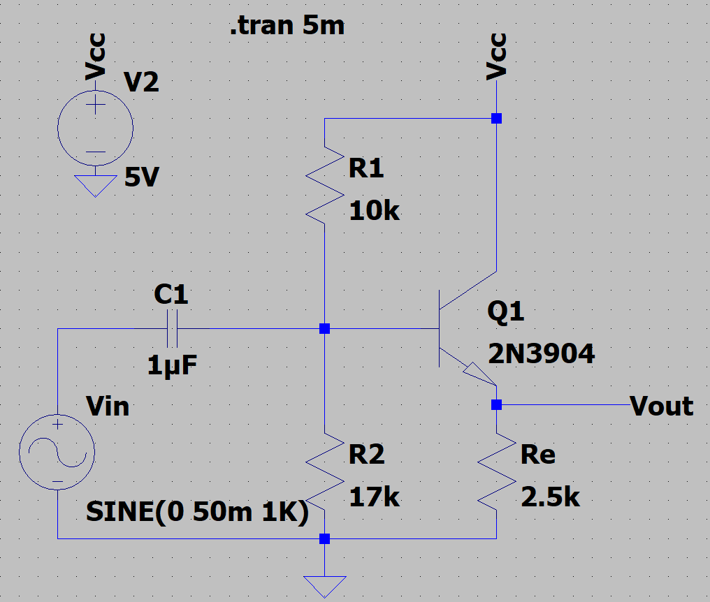

level-shifter

Digital level shifting between 3.3V and 5V

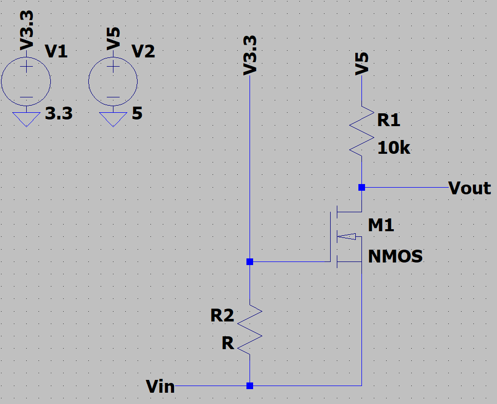

npn-curve

Simulates generic curves for npn transistor

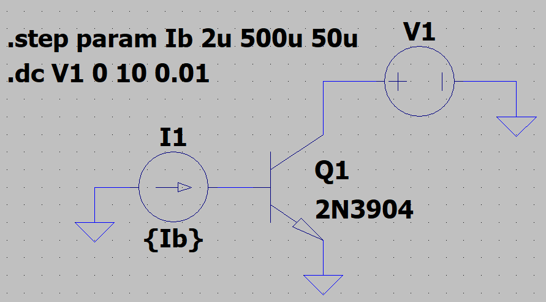

pulse-width-modulation

Pulse width modulated square wave based on 555

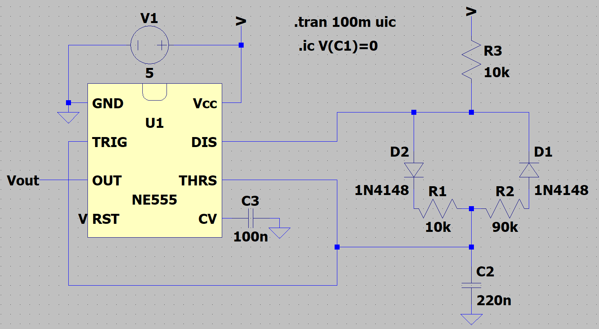

pwm-generator

Modulates pulse width percentage using second 555

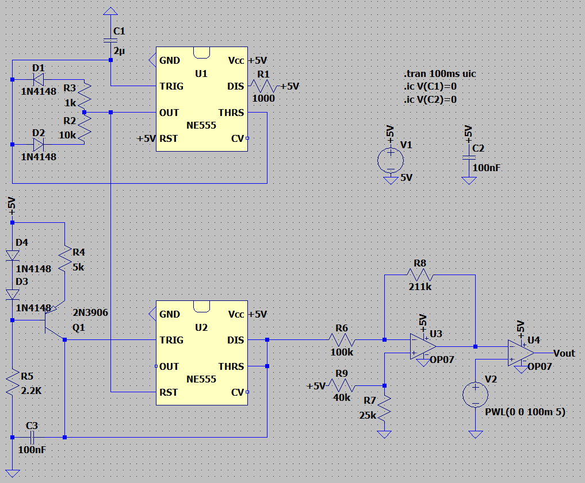

ramp-generator

Generates a ramp (sawtooth) wave

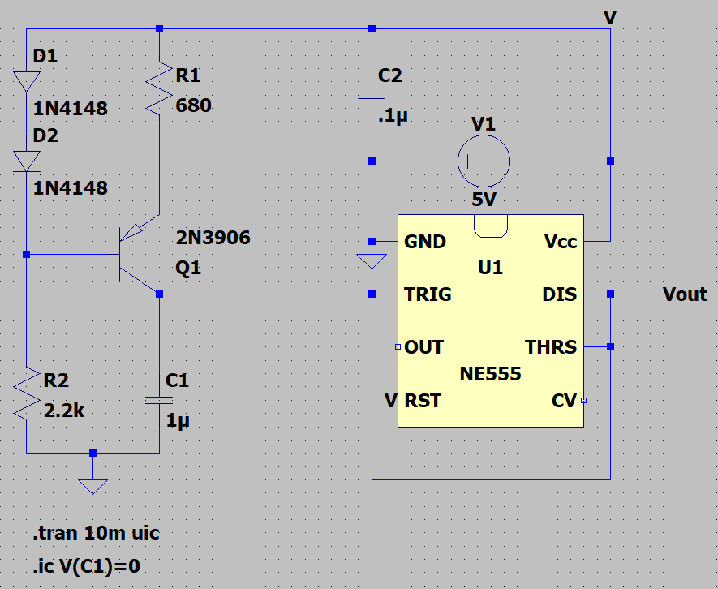

square-wave-relaxation-oscillator

Simple square wave relaxation generator

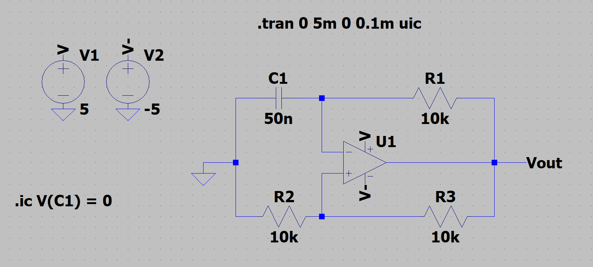

voltage-controlled-servo-controller

Generates a PWM signal suitable for hobbyist servo motors (5-10% on 20ms period), based linearly on a 0-5V input control voltage

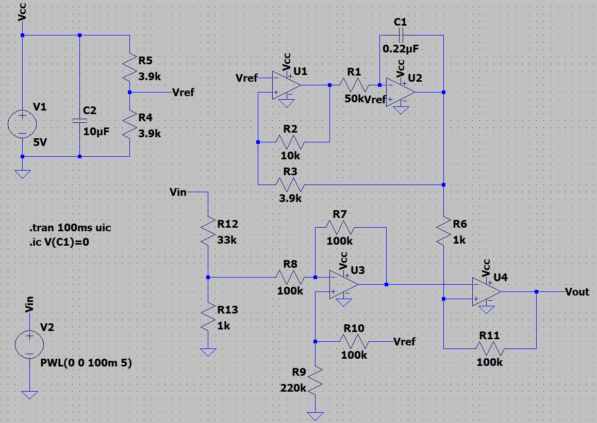

